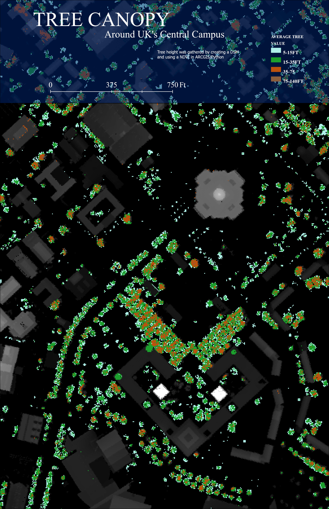
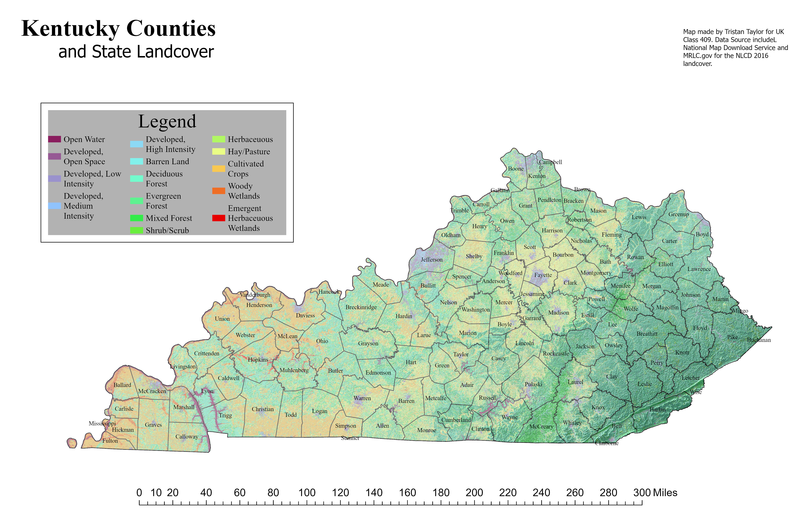

# GEO 409 Field Trip Mapping Project

### Land Cover and Tree Canopy Maps: Kentucky and Central UK Campus

**Author:** Tristan Taylor  
**Course:** GEO 409 – Advanced GIS  
**University:** University of Kentucky  
**Date:** May 2025

---

## Tree Canopy Height – Central UK Campus

### Tree Canopy Map – JPEG  

**Download PDF version:**  
[Tree Canopy PDF](Tree_Canopy_PDF.pdf)

**Details:**
- **Title:** Tree Canopy Height Model  
- **Subtitle:** Central Campus, University of Kentucky  
- **Data Sources:** NAIP 2018, KY DSM & DEM, NDVI canopy filter  
- **Method:** Canopy height was calculated by subtracting the DEM from the DSM and filtering vegetation using an NDVI threshold.

---

## Kentucky Land Cover Map

### Kentucky Land Cover – JPEG  

**Download PDF version:**  
[KY Land Cover PDF](KY_PDF.pdf)

**Details:**
- **Title:** Kentucky Counties  
- **Subtitle:** And State Landcover  
- **Data Sources:** NLCD 2016 via KyRaster
